# Projekt: System monitorowania i powiadamiania z użyciem ESP8266, MQTT, InfluxDB, Grafana, Speech-to-Text i Object Detection

## Opis projektu

Ten projekt to kompleksowy system monitorowania i powiadamiania, łączący kilka technologii do zbierania, przetwarzania i wizualizacji danych. Główne komponenty systemu obejmują:

- **ESP8266**: Mikrokontroler do zbierania danych z czujników i wysyłania ich przez MQTT.
- **Subscriber**: Usługa w Pythonie do odbierania wiadomości MQTT i zapisywania ich w bazie danych InfluxDB.
- **Speech-to-Text**: Moduł do przekształcania mowy na tekst z użyciem mikrofonu i modelu Whisper.
- **Video-to-Text (Object Detection)**: Moduł do wykrywania obiektów w wideo za pomocą kamery i modelu YOLO.
- **MQTT Broker**: Używany do przesyłania wiadomości między komponentami systemu.
- **InfluxDB**: Baza danych szeregów czasowych do przechowywania danych od Subscriber.
- **Grafana**: Platforma do wizualizacji danych z InfluxDB.
- **Wyświetlacz LCD**: Do wyświetlania wyników rozpoznawania mowy i wykrywania obiektów.

## Struktura projektu
````
project/
├── esp8266/            # Code for the ESP8266 microcontroller
├── subscriber/         # Python service for MQTT subscription and InfluxDB logging
├── speech-to-text/     # Speech recognition module
├── video-to-text/      # Object detection module
├── docker-compose.yml  # Docker configuration for InfluxDB and Grafana
├── README.md           # Project documentation

`````
## Autorzy

- Maksim Piatlitski i Maksym Veduta — deweloper projektu.

## Wymagania środowiskowe

- **Python 3.9+**
- **Docker i Docker Compose**
- **ESP8266 z podłączonymi czujnikami**
- **Kamera do przetwarzania wideo**
- **Mikrofon do rozpoznawania mowy**
- **MQTT Broker z obsługą SSL/TLS**

## Instalacja i uruchomienie

### 1. Konfiguracja ESP8266

1. Zainstaluj Arduino IDE.
2. Zainstaluj niezbędne biblioteki:
   - `PubSubClient`
   - `ESP8266WiFi`
   - `WiFiClientSecure`
   - `ArduinoJson`
   - `DallasTemperature`
   - `OneWire`
   - `LiquidCrystal_PCF8574`
3. Wgraj kod z folderu `esp8266` na swój mikrokontroler.
4. Skonfiguruj parametry Wi-Fi i MQTT w kodzie.

### 2. Uruchomienie Subscriber, InfluxDB i Grafana

1. Przejdź do katalogu `subscriber`.
2. Upewnij się, że plik `docker-compose.yml` jest poprawnie skonfigurowany.
3. Uruchom polecenia: `bash docker-compose build docker-compose up -d`
4. Sprawdź, czy usługi są uruchomione i dostępne.


### 3. Konfiguracja Speech-to-Text

1. Zainstaluj zależności: `bash pip install -r speech-to-text/requirements.txt`
2. Uruchom moduł: `bash python speech-to-text/main.py`

### 4. Konfiguracja Video-to-Text (Object Detection)

1. Zainstaluj zależności:`bash pip install -r video-to-text/requirements.txt`
2. Upewnij się, że kamera jest podłączona i działa.
3. Uruchom moduł:`bash python video-to-text/main.py`


### 5. Konfiguracja MQTT Broker

Użyj dostępnego MQTT Brokera z obsługą SSL/TLS lub skonfiguruj własny. W tym projekcie używany jest broker `p4cfdde2.ala.eu-central-1.emqxsl.com`.

## Diagramy




